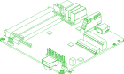
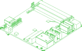
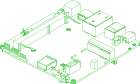
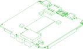
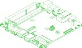
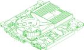
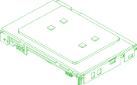
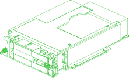

# //pub/electronics/sbcs/intel

Intel NUC boards (now made by ASUS)

Intel NUC boards (the NUC business has been with ASUS since 2023) as
single-solid envelopes for assembly work: interference checks, clearance and
enclosure design. Each part is reduced from the vendor's PCBA model, which
describes the board as an assembly of hundreds of components (20-125 MB of
STEP per board), as published at https://www.asus.com/support/faq/1052528/

What each part is:

- **One solid.** The whole board, fused. Components that float in the vendor
  model (solder gaps) are tied to the board by thin rods.
- **The outer silhouette.** Every component becomes its box, carved by the
  openings visible along its own axes: port mouths with their keys and
  notches, the bores of threaded inserts, the steps of its outline. Openings
  narrower than about 0.7 mm or shallower than 0.6 mm (1 mm on the fan, heat
  sink and other large parts) are walled off, and so are enclosed voids, rows
  of heat sink fins and the gaps between neighbouring passives. Pins,
  contacts, fan blades and everything nobody can see from outside are gone.
- **The PCB exactly as drawn**, outline and every hole of 2.5 mm or more.
  PCB holes that a fastener can reach from both sides are declared as
  `//pub/std/metric/m` through-hole ports (top and bottom), sized by the
  largest metric screw whose ISO 273 fine clearance fits.

Placement: the PCB bottom is on Z=0 and the PCB outline is centred on X=Y=0;
+Z is the vendor's own up.

Not included: the NUC kits (chassis) and power bricks from the same page, and
NUC7i5BNB/NUC7i7BNB, NUC7i3BNB and D34010WYB/D54250WYB, whose STEP archives
are no longer downloadable.

The STEP files are not kept in this repository. `tools/` has the scripts that
produce them from the vendor archives (`tools/regenerate.sh`), GitHub Actions
runs them on every `v*` tag and publishes the results as release assets, and
each part below downloads its file from the release, pinned by its sha256.


## Usage
### Publishing updated STEP files

The STEP files are release assets, not repository files: `*.step` is ignored by
git, and `partcad.yaml` downloads every part from a release, pinned by its
sha256. To publish new ones:

1. **Change what is built.** The reduction is `tools/nuc_envelope.py` (with
   `meshunion.py`, `occ_util.py` and `minify_step.py`); the boards and the
   vendor archives they come from are listed in `tools/boards.tsv`. A new
   board also needs an entry in `BOARDS` in `tools/gen_yaml.py` (its
   description, vendor, SKU and URL).
2. **Try it locally** (optional). With the pinned packages installed
   (`pip install -r tools/requirements.txt`, Python 3.12):

   ```sh
   tools/regenerate.sh nuc12wsb          # one board; no names for all of them
   ```

   This writes `build/<part>.step` and `build/<part>.json` (the report: what
   was done, the read-back check, the PCB holes). Each report has to say
   `"readback": {"solids": 1, "free_shells": 0, ..., "valid": true}`.
3. **Commit and push to `main`, then push a new tag:**

   ```sh
   git tag -a v1.0.2 -m "STEP files v1.0.2"
   git push origin v1.0.2
   ```

   The `Release STEP files` workflow (`.github/workflows/release.yml`) builds
   every board in its own job and publishes `<part>.step`, `<part>.json` and
   `SHA256SUMS` as release `v1.0.2`. It can also be started by hand (Actions >
   Release STEP files > Run workflow, with the tag to create). If a board
   fails, nothing is published: fix it and release under a new tag.
4. **Point the package at the release:**

   ```sh
   gh release download v1.0.2 -R partcad/partcad-electronics-sbcs-intel -D tools/reports \
       -p '*.json' -p SHA256SUMS --clobber
   python3 tools/gen_yaml.py tools/reports partcad.yaml \
       --release https://github.com/partcad/partcad-electronics-sbcs-intel/releases/download/v1.0.2 \
       --sums tools/reports/SHA256SUMS
   ```

   `gen_yaml.py` writes the whole `partcad.yaml`, this text included: edit
   `INTRO` and `USAGE` there, not here.
5. **Check and render**, then commit `partcad.yaml`, `tools/reports/`,
   `README.md` and the `*.svg` previews:

   ```sh
   pc test      # 'manufacturability: No suppliers found' is expected
   pc render    # downloads the release files, writes the SVGs and README.md
   ```

Earlier releases stay where they are, so a package pinned to an older tag of
this repository keeps downloading the files it was published with.


## Parts

### d33217ck
<table><tr>
<td valign=top><a href="d33217ck.step"></a></td>
<td valign=top>Intel NUC Board D33217CK (3rd gen Core i3-3217U)</td>
</tr></table>

### d33217gke
<table><tr>
<td valign=top><a href="d33217gke.step"></a></td>
<td valign=top>Intel NUC Board D33217GKE / DCP847SKE (3rd gen Core i3-3217U / Celeron 847)</td>
</tr></table>

### d53427rke
<table><tr>
<td valign=top><a href="d53427rke.step"></a></td>
<td valign=top>Intel NUC Board D53427RKE (3rd gen Core i5-3427U)</td>
</tr></table>

### de3815tybe
<table><tr>
<td valign=top><a href="de3815tybe.step"></a></td>
<td valign=top>Intel NUC Board DE3815TYBE (Atom E3815)</td>
</tr></table>

### nuc11tnb
<table><tr>
<td valign=top><a href="nuc11tnb.step"></a></td>
<td valign=top>Intel NUC 11 Pro Board NUC11TNB (Tiger Canyon)</td>
</tr></table>

### nuc11tnb-dual-lan
<table><tr>
<td valign=top><a href="nuc11tnb-dual-lan.step"></a></td>
<td valign=top>Intel NUC 11 Pro Board NUC11TNB with the dual LAN expansion module</td>
</tr></table>

### nuc11tnbz
<table><tr>
<td valign=top><a href="nuc11tnbz.step"></a></td>
<td valign=top>Intel NUC 11 Pro Board NUC11TNBi*0Z (no Thunderbolt ports)</td>
</tr></table>

### nuc12 (alias to nuc12wsb)
<table><tr>
<td valign=top></td>
<td valign=top>Intel NUC 12 Pro Board NUC12WSB (Wall Street Canyon)</td>
</tr></table>

### nuc12wsb
<table><tr>
<td valign=top><a href="nuc12wsb.step"></a></td>
<td valign=top>Intel NUC 12 Pro Board NUC12WSB (Wall Street Canyon)</td>
</tr></table>

### nuc12wsb-dual-lan
<table><tr>
<td valign=top><a href="nuc12wsb-dual-lan.step"></a></td>
<td valign=top>Intel NUC 12 Pro Board NUC12WSB with the dual LAN expansion module</td>
</tr></table>

### nuc12wsbz
<table><tr>
<td valign=top><a href="nuc12wsbz.step"></a></td>
<td valign=top>Intel NUC 12 Pro Board NUC12WSBi*0Z (no Thunderbolt ports)</td>
</tr></table>

### nuc13anb
<table><tr>
<td valign=top><a href="nuc13anb.step"></a></td>
<td valign=top>Intel NUC 13 Pro Board NUC13ANB / NUC13L5B (Arena Canyon)</td>
</tr></table>

### nuc14mnb
<table><tr>
<td valign=top><a href="nuc14mnb.step"></a></td>
<td valign=top>ASUS NUC 14 Essential Board NUC14MNB</td>
</tr></table>

### nuc14rvb
<table><tr>
<td valign=top><a href="nuc14rvb.step"></a></td>
<td valign=top>ASUS NUC 14 Pro Board NUC14RVB (Revel Canyon), board only</td>
</tr></table>

### nuc14rvb-thermal
<table><tr>
<td valign=top><a href="nuc14rvb-thermal.step"></a></td>
<td valign=top>ASUS NUC 14 Pro Board NUC14RVB (Revel Canyon) with its thermal module</td>
</tr></table>

### nuc15crb
<table><tr>
<td valign=top><a href="nuc15crb.step"></a></td>
<td valign=top>ASUS NUC 15 Pro Board NUC15CRB (Cyber Canyon)</td>
</tr></table>

### nuc5myb
<table><tr>
<td valign=top><a href="nuc5myb.step"></a></td>
<td valign=top>Intel NUC Board NUC5i3MYBE / NUC5i5MYBE (5th gen Core)</td>
</tr></table>

### nuc7i3dnb
<table><tr>
<td valign=top><a href="nuc7i3dnb.step"></a></td>
<td valign=top>Intel NUC Board NUC7i3DNBE (7th gen Core i3)</td>
</tr></table>

### nuc7i5dnb
<table><tr>
<td valign=top><a href="nuc7i5dnb.step"></a></td>
<td valign=top>Intel NUC Board NUC7i5DNBE / NUC7i7DNBE (7th gen Core i5/i7)</td>
</tr></table>

### nuc8cchb
<table><tr>
<td valign=top><a href="nuc8cchb.step"></a></td>
<td valign=top>Intel NUC Board NUC8CCHB (Chaco Canyon, 8th gen Core i5)</td>
</tr></table>

### nuc8pnb
<table><tr>
<td valign=top><a href="nuc8pnb.step"></a></td>
<td valign=top>Intel NUC Board NUC8v7PNB / NUC8v5PNB / NUC8i3PNB (Provo Canyon)</td>
</tr></table>

### nuc9qnb
<table><tr>
<td valign=top><a href="nuc9qnb.step"></a></td>
<td valign=top>Intel NUC 9 Compute Element NUC9i5QNB / i7 / i9 / V7 / VX (Quartz Canyon)</td>
</tr></table>

<br/><br/>

*Generated by [PartCAD](https://partcad.org/)*
